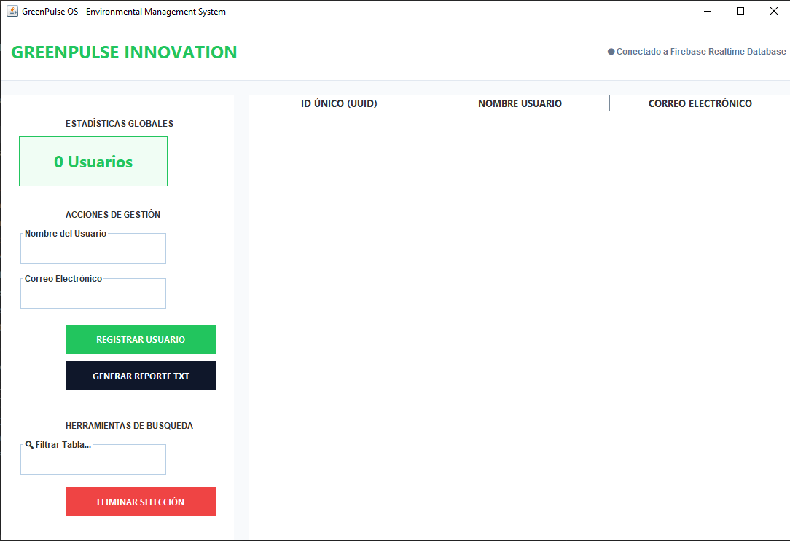

# 🌿 GreenPulse Management System!



**Sistema de gestión ambiental con Java Swing y Firebase Realtime Database.**

GreenPulse es una aplicación de escritorio diseñada para monitorear y gestionar métricas ambientales en tiempo real. Utiliza una arquitectura robusta y conexión directa a la nube para garantizar la integridad de los datos.

## 🚀 Características
* **Dashboard en tiempo real**: Visualización dinámica de datos mediante Firebase SDK.
* **Interfaz Profesional**: Diseñada con Java Swing para una experiencia de usuario fluida.
* **Gestión de Datos**: CRUD completo conectado a Firebase Realtime Database.
* **Seguridad**: Manejo de credenciales mediante variables de entorno y archivos de configuración protegidos.

## 🛠️ Tecnologías utilizadas
* **Lenguaje**: Java 17+
* **Base de Datos**: Firebase Realtime Database
* **Gestión de Dependencias**: Maven
* **Librerías**: Firebase Admin SDK, Google Auth.

## 🔧 Instalación y Configuración
1. Clona el repositorio:
   ```bash
   git clone [https://github.com/alexandraparedes4563-create/GreenPulse-Management-System.git](https://github.com/alexandraparedes4563-create/GreenPulse-Management-System.git)